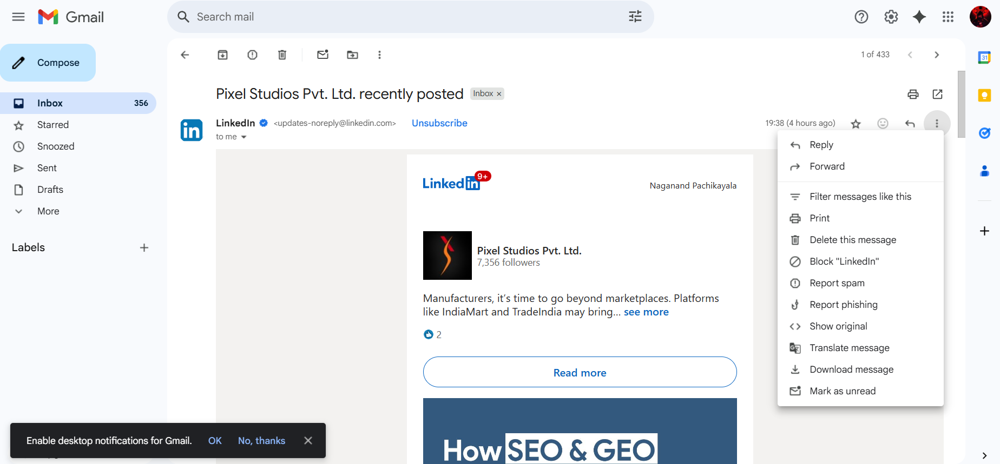
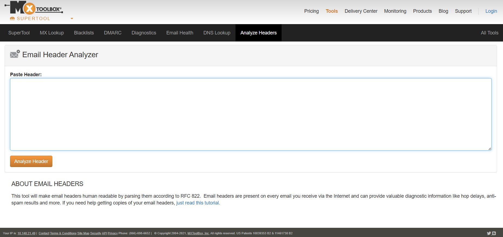
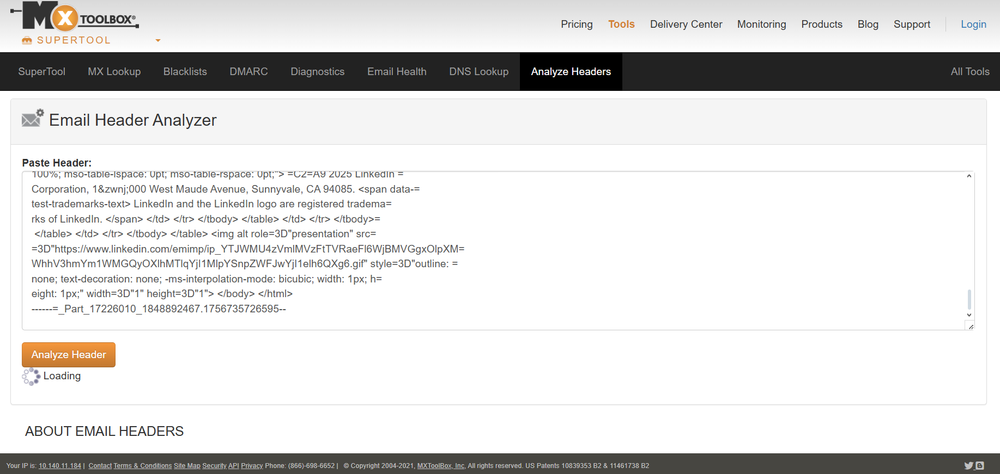
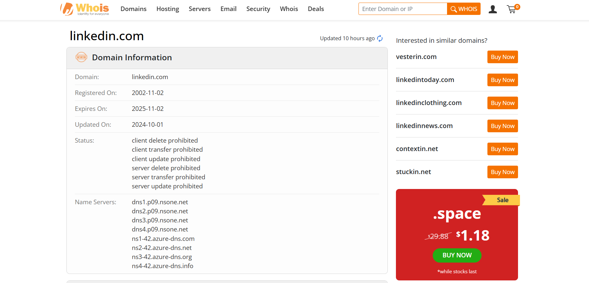
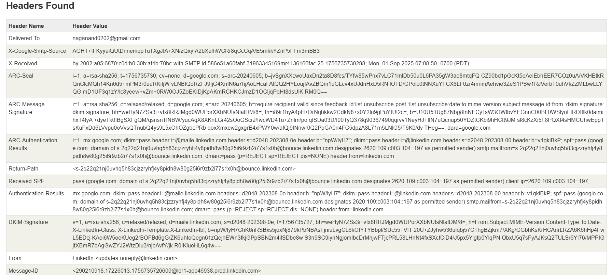
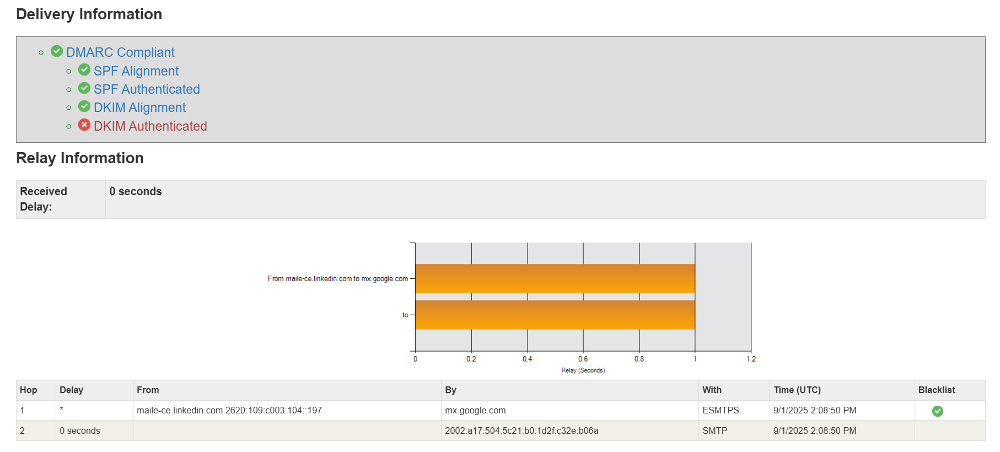
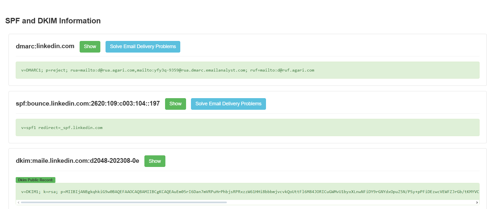

# Experiment-4: Analyze Email Headers and Detect Email Spoofing Using Mail Header Analyzer

**Course / Lab:** Digital Forensics Lab  
**Experiment No.:** 4  
**Title:** Analyze Email Headers and Detect Email Spoofing Using Mail Header Analyzer  

---

## Aim
To analyze email headers and detect possible spoofing or malicious activity using Mail Header Analyzer.

---

## Requirements
- Mail Header Analyzer tool  
- Any email client (Gmail / Outlook / Yahoo) with suspicious email samples  

---

## Description
An email header contains routing information, including sender, recipient, subject, and most importantly, the path the email took across servers.  
Attackers often forge headers to trick recipients, called **email spoofing**.  

By analyzing headers, we can identify:  
- Real sender IP address  
- Authentication results (SPF, DKIM, DMARC)  
- Time delays between servers  
- Signs of spoofing / phishing  

---

## Procedure — Steps to Analyze Email Headers

**Step-1:** First, get the email header. In Gmail, select the mail, click the three dots, and choose **Show Original**.  

**Step-2:** After clicking **Show Original**, you will see the raw message with sender and receiver details.  

**Step-3:** Use the **Mail Header Analyzer tool** for easy reading and analysis.  

**Step-4:** Copy and paste the entire header text into the tool and click **Analyze Header**.  

**Step-5:** Identify key header fields:  
- From  
- To  
- Subject  
- Date  
- Return-Path  
- Received  
- Message-ID  
- SPF / DKIM / DMARC  

**Step-6:** Check for IP addresses and hostnames.  
- Use tools like **WHOIS** or online IP lookup services to identify the geographical location and ownership of IP addresses found in the *Received* lines.  
- Verify if any IPs are suspicious or if the hostname doesn’t match the expected sending server.

**Step-7:** Examine the SPF, DKIM, and DMARC results:  
- **SPF (Sender Policy Framework):** Checks if the sender’s server/IP is authorized for that domain.  
- **DKIM (DomainKeys Identified Mail):** Ensures the email content wasn’t changed.  
- **DMARC (Domain-based Message Authentication, Reporting & Conformance):** Provides domain-level email authentication, policy, and reporting.

---

## Expected Output
- The Mail Header Analyzer highlights key email header fields.  
- Authentication checks (SPF/DKIM/DMARC) show whether the email is genuine or spoofed.  
- Suspicious IP addresses or mismatched hostnames can be identified.  
- Email spoofing or phishing attempts are detected.  

---
