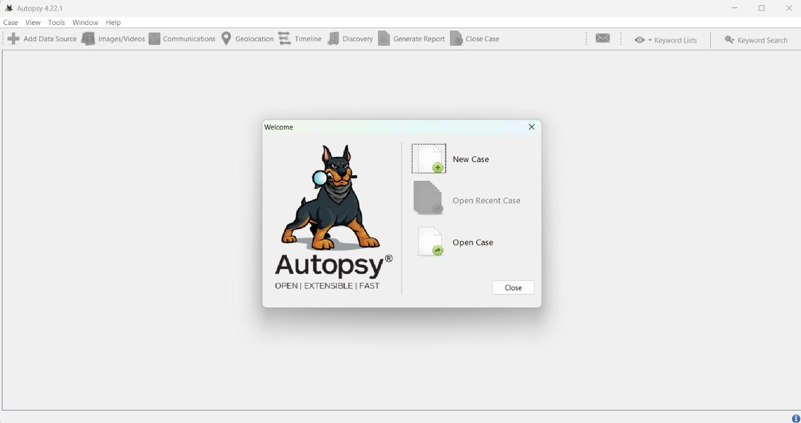
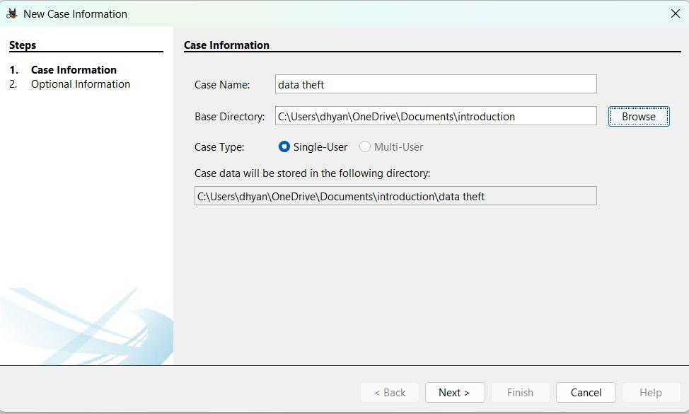
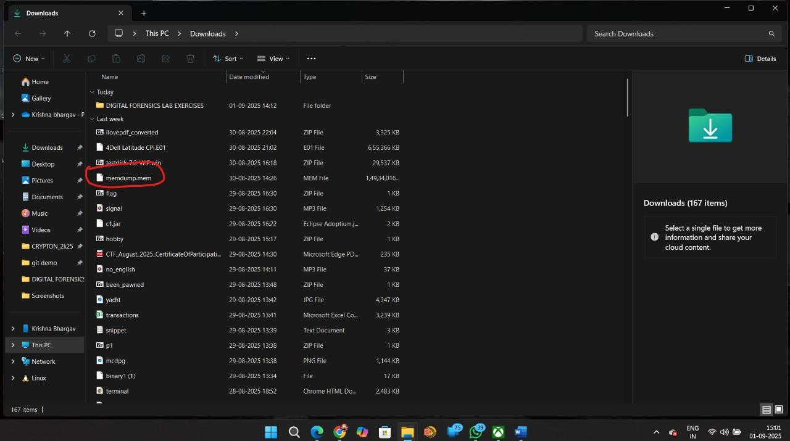
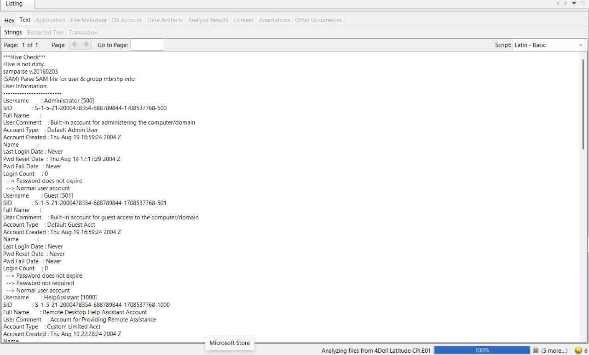
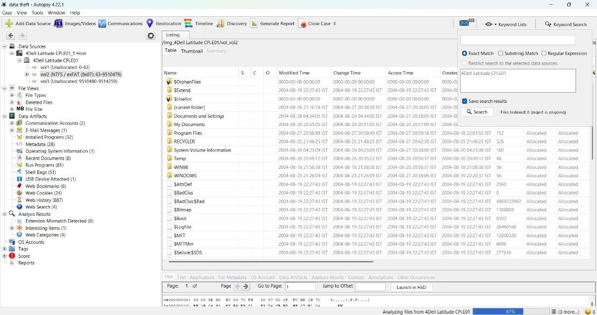
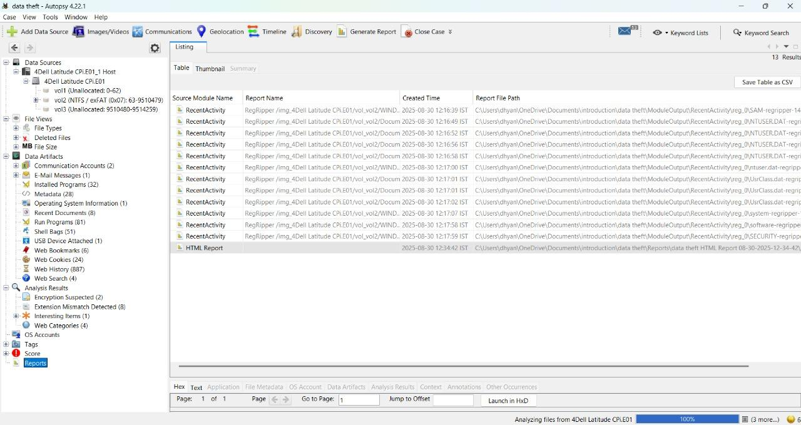
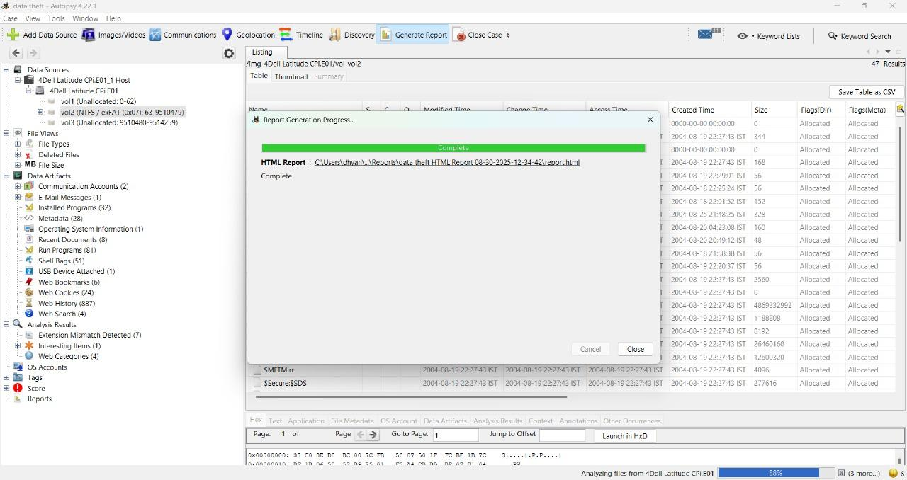
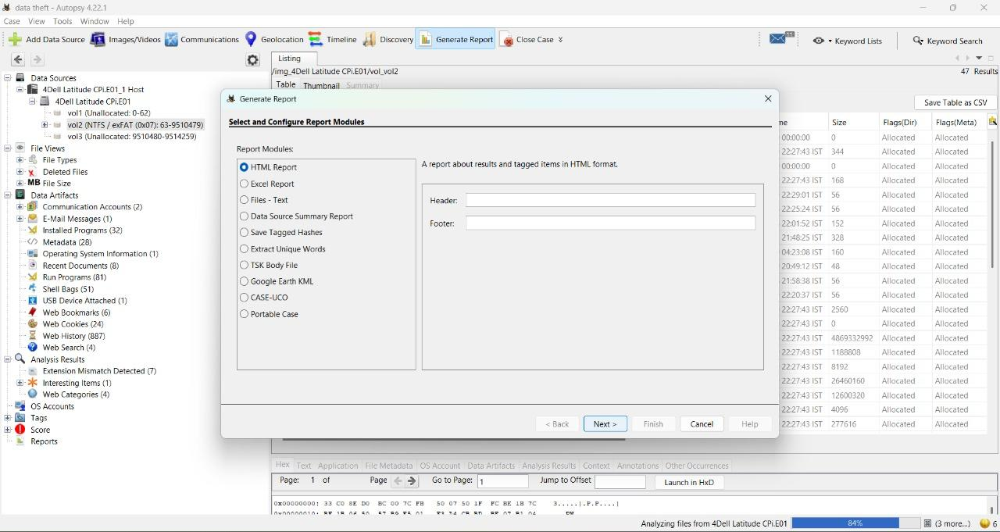
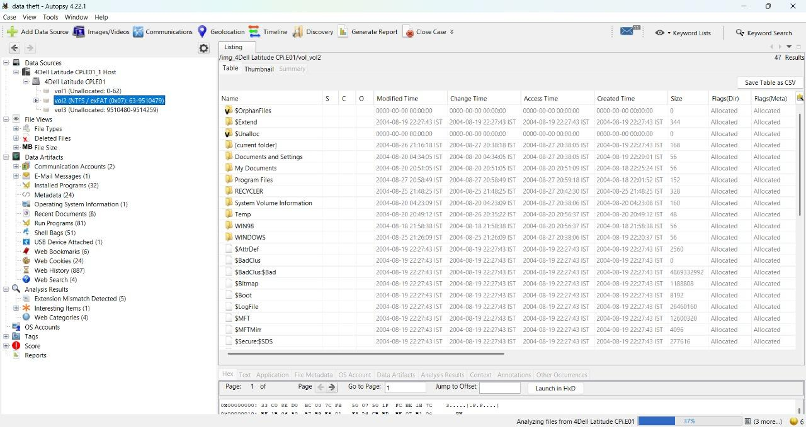
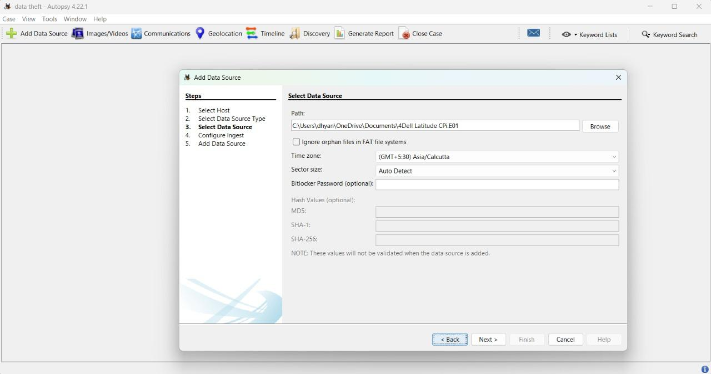

# Experiment-5: Case Creation and Evidence Analysis Using Autopsy

**Course / Lab:** Digital Forensics Lab  
**Experiment No.:** 5  
**Title:** Case Creation and Evidence Analysis Using Autopsy  

---

## Aim
To create a forensic case, add disk image evidence, and analyze findings using the Autopsy forensic tool.

---

## Requirements
- Autopsy (latest version)  
- Windows / Linux / macOS operating system  
- Evidence images: 4Dell Latitude CPi.E01, 4Dell Latitude CPi.E02  

---

## Procedure

**Step-1:** Launch Autopsy and open the welcome screen.

**Step-2:** Click **New Case** and enter details like Case Name, Case Number, Examiner Name, and save location.

**Step-3:** Prepare your evidence files (.E01) and ensure they are available (for example, check Downloads folder).

**Step-4:** Click **Add Data Source**, choose **Image File**, and browse for your evidence file.

**Step-5:** Select and configure the ingest modules for analysis (File Type Identification, Hash Lookup, etc.).

**Step-6:** Monitor the progress of analysis, viewing the status bar and indexed file counts.

**Step-7:** Explore evidence using the Tree Viewer, reviewing file system, artifacts, web history, and communications.

**Step-8:** Use keyword search, timeline, and artifact modules for deeper investigation.

**Step-9:** Generate the investigation report in your chosen format (HTML, CSV, Excel).

**Step-10:** Review final reports, validate important evidence, and archive/close the case.

---

## Observation
Autopsy successfully processed the evidence files, extracted OS, user, file activity, metadata, and other key artifacts.

---

## Result
A forensic case was created, disk image evidence imported, findings analyzed, and a case report generated.

---

## Tools Used
- Software: Autopsy  
- Evidence: 4Dell Latitude CPi.E01, 4Dell Latitude CPi.E02  

---

## Conclusion
Autopsy provides a robust suite for digital forensic investigations, combining acquisition, modular analysis, and reporting in a user-friendly workflow.

---

